# Web App Dev 2 - Assignment 1 - ReactJS app.

Name: Jack Duggan

## Overview.

### New Pages.

+ List of Upcoming Movies
+ List of Must Watch Movies
+ List of Television Shows
+ List of Favourite Television Shows
+ Television Show Review Form
+ Television Show Reviews
+ Modified colour & appearance of all pages.

### New Features.

+ Can view a list of upcoming movies set for release in the future, with functionality for name and genre filtering.
+ Added ability to add movies from the upcoming movies list to a seperate "must watch" list. Once added, they can be viewed on the "Must Watch" page. To add the movie, click the playlist icon. The appearance of the card will then update to reflect its must watch status, much like the favourite movies.
+ Added a telelvision shows data model and the ability to view a list of television shows. This page also has name and genre filtering functionality.
+ Added ability to add television to favourites, much like you can for movies. The selected shows are added to or deleted from a favourites list which can be viewed on the "TV Shows Favourites" page.
+ You can view more information about a TV show, view a summary of the show, its genres, rating, and production countries.
+ Added review support for television shows with the ability to add a review as well as see critics' reviews.

## Setup requirements.

After cloning the repo, you will need to have npm installed on the machine to be able to run it.

## TMDB endpoints.

+ /movie/upcoming - Upcoming Movies
+ /tv/popular - Popular Television Shows
+ /tv/${id} - Details About Television Show
+ /genre/tv/list - Television Show Genres
+ /tv/${id}/images - Television Show Images
+ /tv/${id}/reviews - Television Show Reviews

### Component catalogue.

No new Storybook functionality added

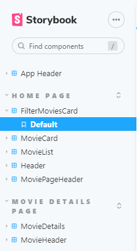

### UI Design.

#### New Pages

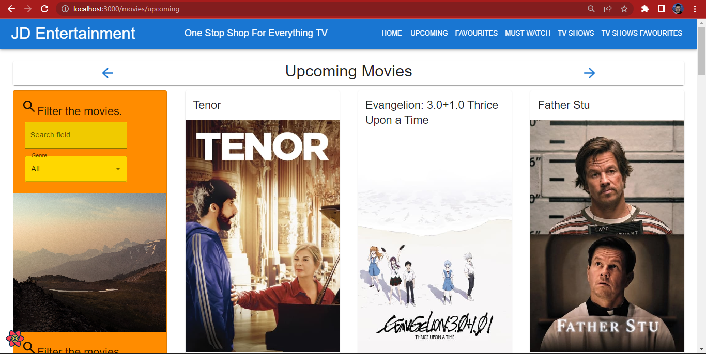
>Shows a list of upcoming movies with functionality for name and genre filtering.

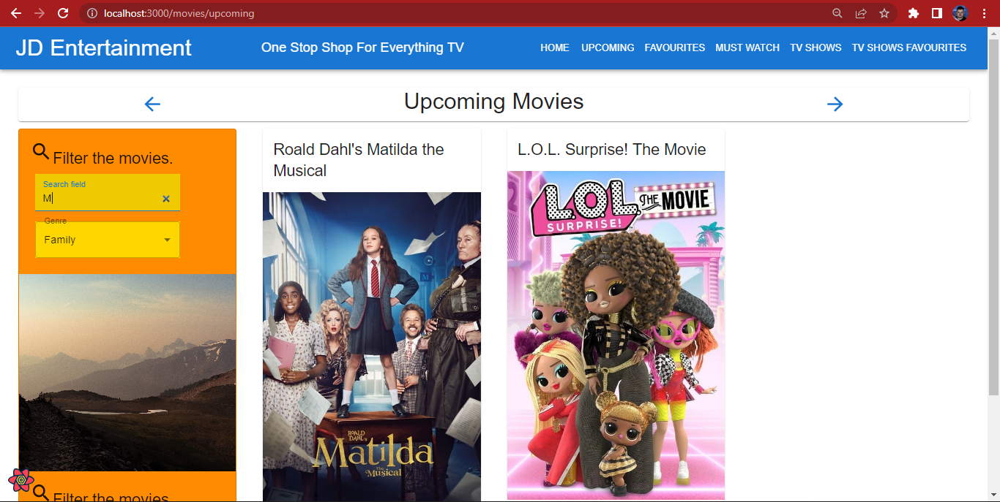
>An example of the upcoming movie filtering in action, filtered by name & genre together.

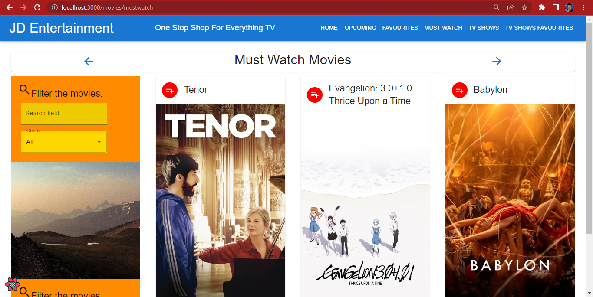
>A list of movies tagged "must watch" on the upcoming movies page.

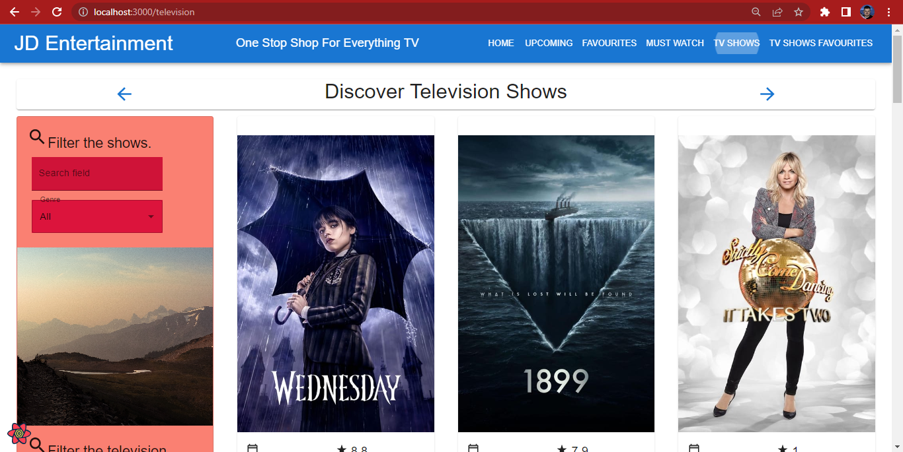
>Shows a list of popular tv shows with functionality for name and genre filtering.

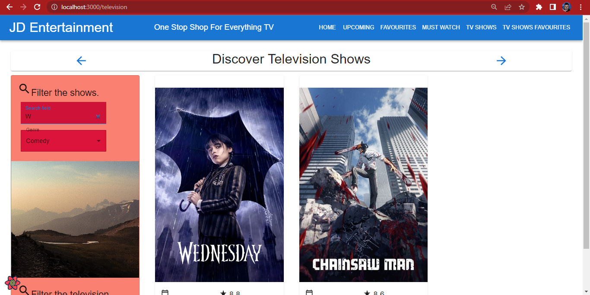
>An example of the tv shows filtering in action, filtered by name & genre together.

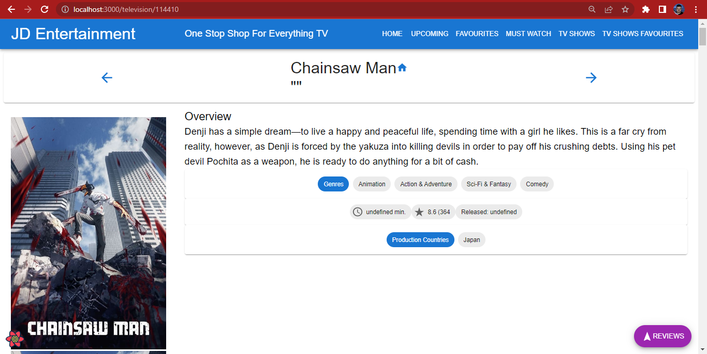
>A detailed view of the tv shows, showing a summary, genres, production countries and more.

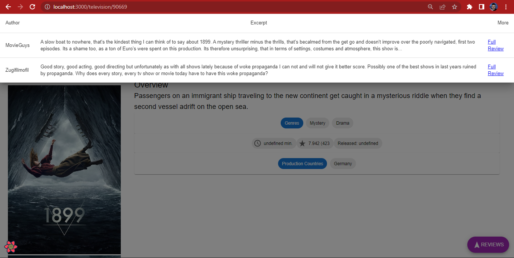
>A page showing the posted reviews for a tv show, in this case the Netflix show "1899".

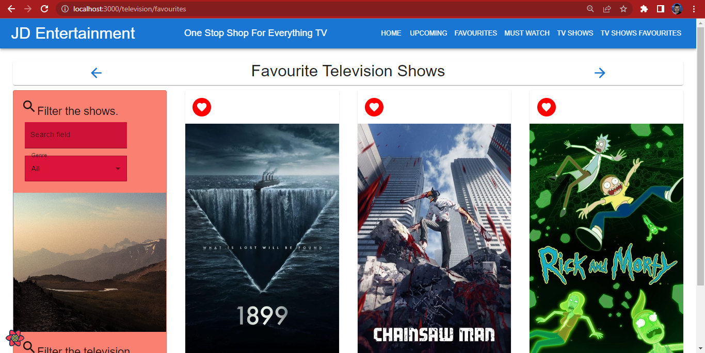
>A list of tv shows tagged "favourite" on the tv shows page.

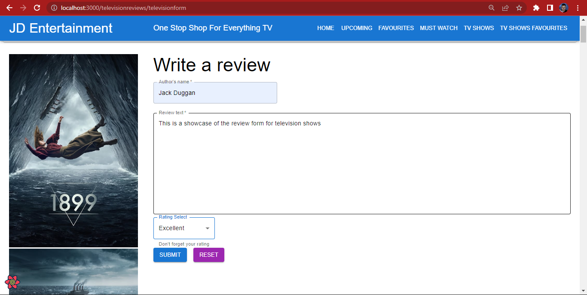
>A page that allows the user to write a review for their favourite tv shows. Can only be accessed via the "Favourite TV Shows" page.

#### Updated Pages

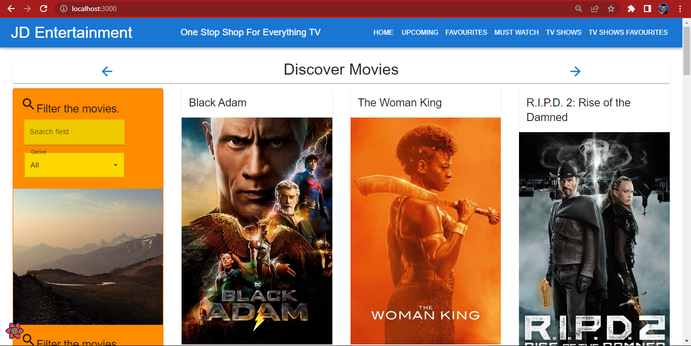
>Movies home page updated with redesigned menu bar and genre filtering.

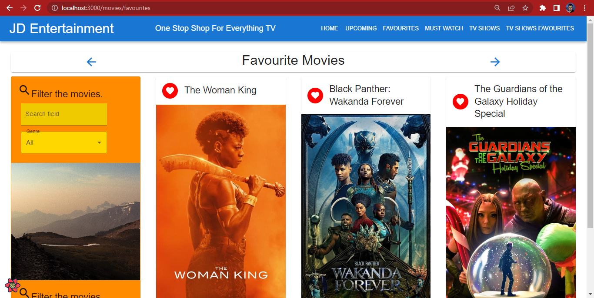
>Favourite movies page updated with redesigned menu bar and genre filtering.

### Routing.

+ /movies/upcoming - Upcoming Movies Page
+ /movies/mustwatch - Must Watch Movies Page
+ /television - Popular TV Shows Page
+ /televisionreviews/televisionform - Write TV Show Review Page
+ /televisionreviews/:id - See Full TV Show Review
+ /television/favourites - Favourite TV Shows Page
+ /television/:id - TV Show Details Page
